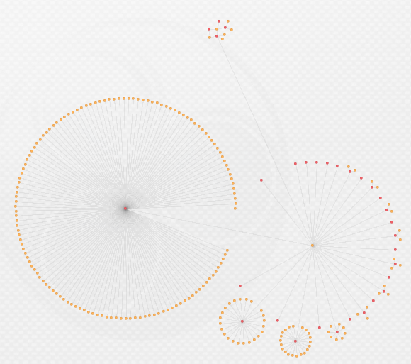
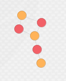
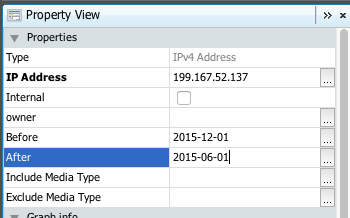
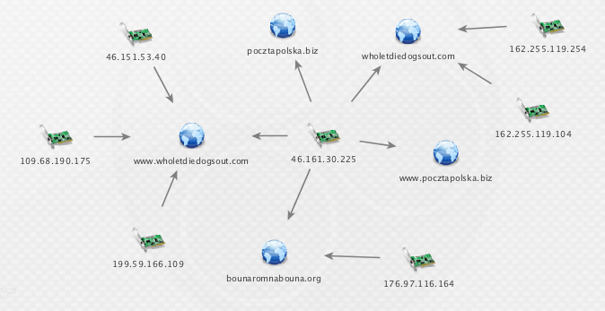
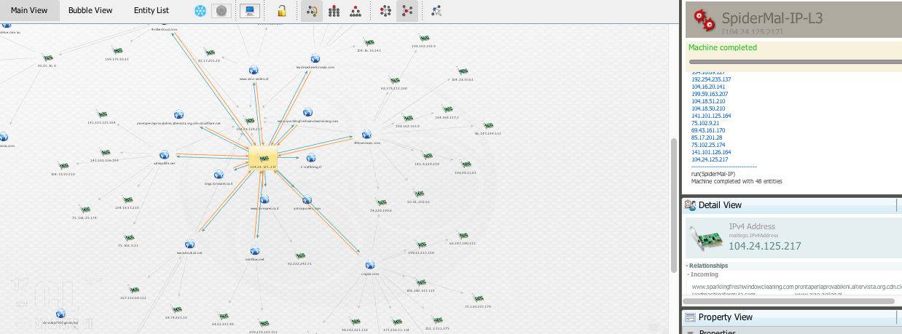
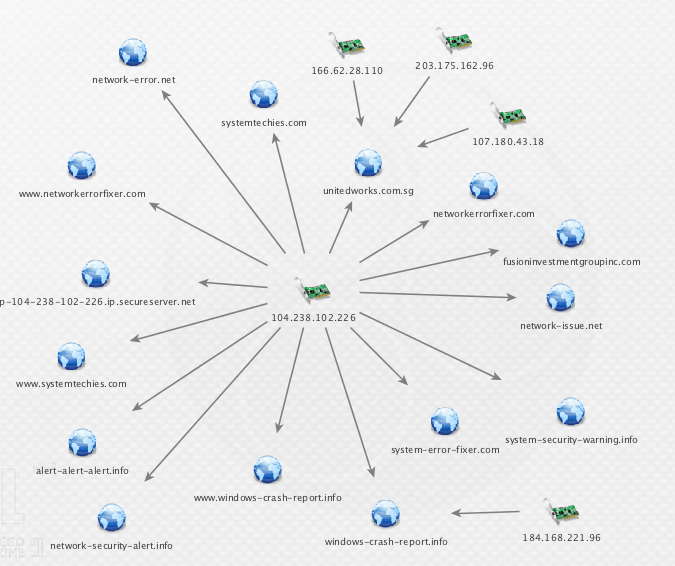

###[+] Summary [+]

SpiderMal is a Python script that can be run from the CLI or, alternatively, pointed to by a Maltego transform. At it's core, it uses the PassiveTotal API to resolve domains to IP's, and vice versa with their pDNS data, then recursively crawls from the seeded entity out to a specified level. This can easily be accomplished through the existing PassiveTotal Maltego transforms by chaining together lookups; however, SpiderMal also includes the ability to filter results based on temporal range so that only domains or IP's seen within a specified date range are included in the graph, thus reducing the noise and allowing an analyst to fine tune their results before diving in further.

This script is intended to jumpstart Maltego graphs to identify interesting clusters, or links, with some additional filtering control.

From three levels of recursive searching with no date filtering...



To only 2015 data...



###[+] Change Log [+]

v1.0.2
* Added some additional error handling for PassiveTotal's API.

v1.0.1
* Added a verbose flag to print out tags/classifications/nature of the domain or IP (not included in Maltego).
* Added some logic to handle timeouts and whether or not to include large results, such as hosting providers, into the graphs.

v1.0.0
* Initial release - CLI and Maltego transforms/machines working.

###[+] Notes [+]

* Currently supports PassiveTotal API but the only real input you need for other API's are the domain/resolution,  a first seen, and a last seen date to integrate into the script.
* Specify your API key in "spidermal.py" towards the top (variable is "apikey"). 

###[+] General Usage [+]

#####  [-] CLI [-]

The only required flag ("-l") is used to specify the entity to lookup, either a domain or an IP.

Below is an example of doing a search seeded with the domain "pocztapolska.biz". All results are filtered to only match entities which were between 2014-09-12 and 2015-12-1; anything outside of that range will be ignored. The recursive level is set to 3 and on the first run it found 1 result. The second run will lookup all domains for the IP found in the first run and pull matches from them to build the edges between nodes. The third run begins by iterating through each domain and pulling their resolutions, so on and so forth. This can quickly get out of hand, especially if you hit a content provider/hosting site.

```
python spidermal.py -l pocztapolska.biz -s 2014-09-12 -e 2015-12-1 -r 3 -o certpol.mtgx -a PT
[+] Begining search for pocztapolska.biz using PT API between 2014-09-12 and 2015-12-01.
    [@] Beginning recurse search number 1.
    [$] 1 results for pocztapolska.biz.
	[=] MATCH: 46.161.30.225
    [@] Beginning recurse search number 2.
    [$] 9 results for 46.161.30.225.
	[=] MATCH: wholetdiedogsout.com
	[=] MATCH: www.pocztapolska.biz
	[=] MATCH: www.wholetdiedogsout.com
	[=] MATCH: bounaromnabouna.org
    [@] Beginning recurse search number 3.
    [$] 4 results for www.wholetdiedogsout.com.
	[=] MATCH: 46.151.53.40
	[=] MATCH: 199.59.166.109
	[=] MATCH: 109.68.190.175
    [$] 5 results for wholetdiedogsout.com.
	[=] MATCH: 162.255.119.104
	[=] MATCH: 162.255.119.254
    [$] 2 results for bounaromnabouna.org.
	[=] MATCH: 176.97.116.164
    [$] 1 results for www.pocztapolska.biz.
[+] Finished API queries.
[+] Building graph (nodes/edges).
[+] Building Maltego file named certpol.mtgx.
```  

#####  [-] Maltego [-]

There are two options within Maltego itself. Either running a local transform on a specific IP/Domain or running a Machine (which chains 3 transforms together, IP -> Domain -> IP or vice versa). To filter by date, select the seeding entity and put a date in format YYYY-MM-DD into the "Before" and "After" fields. Dates are not necessary but they are one of the main problems this tool seeks to address. If not dates are specified, the "Before" value defaults to 1970-01-01 and "After" will be todays date.



###[+] Maltego Install [+]

* Copy the ".machine" files into %maltegopath%/<version>/config/Maltego/Machines
* Copy the ".transform" and ".transformsettings" into %maltegopath%/<version>/config/Maltego/TransformRepositories/Local

###[+] Examples [+]

The lookup from the above query is below, which was a site used by the Postal Group reported on by CERT.pl.



A query against a phishing site built with a run of the SpiderMal-IP-L3 Machine within Maltego.



A query against an IP address identified as hosting a fake Tech Support site.


